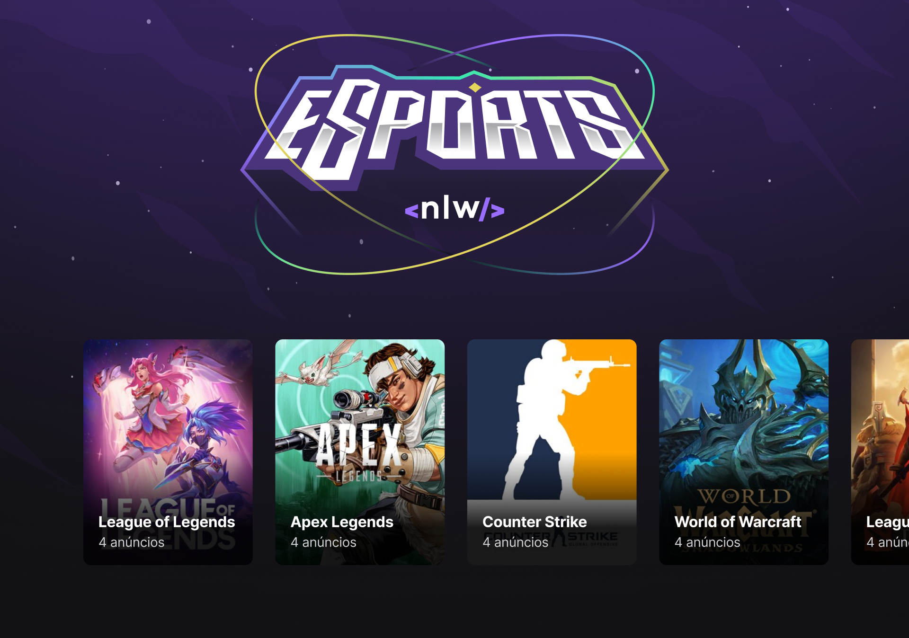

    

<h1 align="center">
	NLW eSports
</h1>

<h3 align="center">
    A code event by <a href="https://www.rocketseat.com.br/" target="_blank">Rocketseat</a>
</h3>

---

## 🚀 Project

It can be hard to have a Duo to play with, that's why we created the perfect place to find the perfect Duo for your favorite games.

---

## 🔧 Technologies

- Vite
- TailWindCSS
- ReactJS
- NodeJS
- React native
- Expo
- Twitch API

---

## 🧑‍💻 How to execute

- Clone the repository

- Run ' npm install ' in the web, mobile and server directories

- On Web directory run ' npm run dev ' and access localhost:3000 to see the front end running

- On Server directory run ' npm run dev ' to start the server

- On Mobile directory run ' expo start ' to start expo
